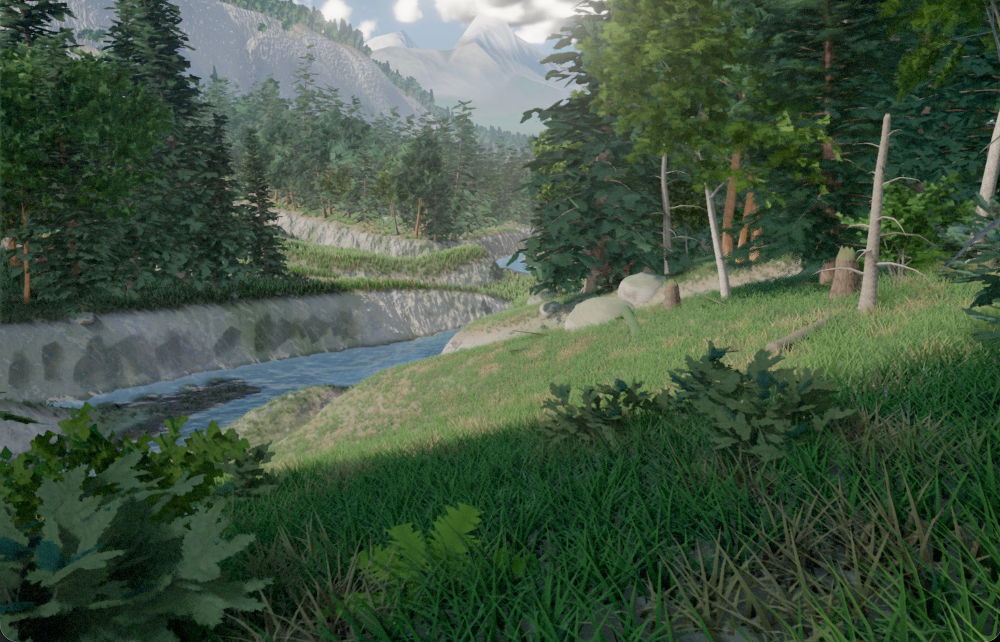

# LAAS — 절차적 4×4km 월드 (한글화)

> *Laas — 에스토니아어로 "원시림(老樹林)"을 뜻합니다.*

[](https://sigco3111.github.io/fable5-world-demo/)
[](https://github.com/Braffolk/fable5-world-demo)
[](LICENSE)



> **무수정 엔진 출력.** 이 프레임의 모든 메시·텍스처·조명은 부팅 시 코드가 생성합니다 — 저장소에는 이미지·모델·오디오 자산이 단 하나도 들어있지 않습니다.

LAAS는 브라우저의 **WebGPU** 위에서 동작하는 완전한 절차적 4×4 km 오픈 월드입니다. three.js의 `WebGPURenderer` + TSL 머티리얼 + WGSL 컴퓨트 셰이더, `any` 0개짜리 TypeScript strict 모드, WebGL 폴백 없음. 전 세계는 단일 URL 파라미터(`?seed=N`)만으로 재현 가능합니다.

라이브 데모 : https://sigco3111.github.io/fable5-world-demo/

---

## 🎯 이 프로젝트는 무엇인가

이 저장소는 **Anthropic의 Claude Fable 5** 모델 역량을 시험하기 위해 만들어졌습니다. 코드베이스의 약 99%는 모델이 자율적으로 작성했고, 사람의 개입은 최소화되었습니다:

- 사람은 단 **한 개의 문서만 부분적으로 작성**했습니다 — [PROJECT_LAAS_v2.md](PROJECT_LAAS_v2.md) (브리프). 시각적 기준선(UE5급 참조 프레임), 하한선(삼각형 수·시스템 목록·월드 크기), 금지 결과(검은 그림자·클론 나무·안개를 가림으로 쓰는 행위)만 명시했고, 구현 방법은 일부러 적지 않았습니다.
- 그 외 모든 것(아키텍처, 엔진·월드 시스템, 검증 도구, 디버깅, 작업 노트, 본 README)은 **Fable 5가 긴 자율 세션에 걸쳐** 직접 기획하고 실행했습니다.
- 사람의 입력은 모델이 정적 출력만으로는 판단하기 어려운 부분에만 제한적으로 들어갔습니다 — 모션 효과가 자연스러운지, 인터랙티브 성능이 유지되는지, 움직일 때만 보이는 아티팩트가 있는지 등. 작업 로그 예: 바람 흔들림 진폭, 걸을 때 카메라 흔들림, 카메라를 따라가는 구름 모션, 물의 분포감.

**모델이 직접 QA를 수행합니다.** Playwright로 Chromium(WebGPU/Metal 어댑터)을 헤드리스로 구동해 스크린샷을 찍고, 픽셀을 샘플링하고, 프레임 정렬 결정성으로 베이스라인과 비교하고, 인코더별 GPU 패스를 프로파일링하고, 발견한 버그에 대한 회귀 프로브를 작성합니다. 진단 로그·측정값·판단 기록은 [STATUS.md](STATUS.md)에 보관되며, 이는 세션 간 모델의 영구 메모리 역할을 합니다.

현재 상태: 약 21,000줄의 strict TypeScript, 90+ 커밋, 브리프의 모든 단계가 구현되어 있으며 성능 패스를 진행 중입니다. 알려진 미해결 이슈는 STATUS.md 상단에 정리되어 있습니다.

---

## 🌍 월드에 무엇이 있는가

| 시스템 | 구현 내용 |
|---|---|
| **지형** | 4096² 높이맵 합성, 파이프 모델 수력 + 열 침식, 흐름 누적 하천이 호수와 출구로 이어지는 실제 수로를 깎아냄, 수분·바이옴 분류, 경사/노출 기반 설분. CDLOD 쿼드트리 메시, 균열 없는 스커트, 4km+ 가시 거리용 원셸 디테일 합성 |
| **식생** | 6종 나무를 절차적 분기 문법으로 생성 (인스턴스별 고유 — 두 나무가 같은 메시 공유 안 함), 실제 생성된 잎 지오메트리로 굽는 클러스터 카드 잎, 옥타헤드럴 임포스터, 3종 관목, 양치, 개화 식물, 부패 단계별 쓰러진 나무. GPU 클러스터 Poisson 산포로 배치된 약 19만 그루의 나무와 45만 그루의 하층 식생, 프레임마다 압축 인디렉트 드로우로 컬링. 초원은 약 100만 잎 blades 렌더 |
| **조명** | 4-캐스케이드 섀도우 맵 + PCSS, 스크린 스페이스 컨택트 섀도우, 지형 상대 조도 프로브 필드 GI, GTAO, 스크린 스페이스 바운스, 잎 반투명. "검은 그림자 없음" 규칙은 자동 픽셀 샘플링으로 강제 |
| **대기** | Hillaire LUT 대기가 하늘·에어리얼 퍼스펙티브·광원 색상 구동, 레이마치된 볼류메트릭 클라우드와 클라우드 섀도우, 캐노피 빛줄기/계곡 안개용 froxel 볼류메트릭 |
| **물** | 카메라 추적 클립맵 위의 시냇물·호수 표면, 지형 인지 폴백이 있는 스크린 스페이스 반사, 해석적 코스틱, 장애물 거품, 젖은 가장자리 |
| **모션** | 모든 식생에 계층적 바람, 131,072개 GPU 파티클(눈·꽃가루·떠다니는 잎), 드리프트·소용돌이치는 클라우드 필드 |
| **포스트** | 해석적 카메라 재투영 벡로시티 기반 시간적 AA, 블룸, GPU 자동 노출, 시간대별 필름 등급 |
| **탐험** | 중력·점프·달리기·보폭 동기 카메라 모션이 있는 걸기 모드, 자유 비행 모드, 9개 합성 북마크, 90초 플라잇루 |

---

## 🚀 실행 방법

### 데스크톱/노트북 (권장)

```bash
npm install
npm run dev
```

Google Chrome 113 이상에서 `http://localhost:5173` 을 엽니다. Chromium 기반 브라우저(Edge, Brave, Arc, Opera)도 작동합니다. Safari와 Firefox는 지원되지 않습니다 — 엔진이 Chrome의 WebGPU 구현 환경에서만 빌드/검증되었기 때문이며, 페이지가 로딩 전에 이를 감지하고 안내합니다. 모바일·태블릿 브라우저는 컴퓨터 사용을 권장하는 안내를 받게 됩니다.

WebGL 폴백은 의도적으로 없습니다 — Chrome이 있는데 WebGPU가 없다면, 페이지는 진단 정보와 함께 확인해야 할 정확한 항목(하드웨어 가속, `chrome://gpu`, 브라우저 버전)을 알리고 큰 소리로 실패합니다.

### 컨트롤

| 키 | 동작 |
|---|---|
| 클릭 | 마우스 캡처 |
| `WASD` | 이동 |
| `Shift` | 달리기 |
| `Space` | 점프 |
| `V` | 걸기/비행 전환 |
| 마우스 휠 | 비행 속도 |
| `E`/`Q` | 비행 모드에서 상/하 |
| `1`–`9` | 합성 북마크로 점프 |
| `F` | 플라잇루 시작 |
| `F3` | 패스별 GPU 타이밍이 표시되는 디버그 HUD |
| `P` | 현재 카메라 포즈를 `?cam=` 문자열로 출력 |

### 유용한 URL 파라미터

| 파라미터 | 의미 |
|---|---|
| `?seed=N` | 월드 시드 |
| `?T=hours` | 시간대 (0~24) |
| `?shot=1..9` | 부팅 시 특정 북마크로 진입 |
| `?cam=x,y,z,yaw,pitch[,fov]` | 정확한 포즈 |
| `?preset=low\|high\|ultra` | 품질 프리셋 |
| `?freeze=1` | 월드 모션 정지 |
| `?hud=1` | 부팅 시 HUD 열기 |

---

## 🗂️ 저장소 구조

| 경로 | 설명 |
|---|---|
| `PROJECT_LAAS_v2.md` | 브리프. 저장소에서 사람이 작성한 유일한 문서. |
| `STATUS.md` | 모델의 작업 메모리: 현재 상태, 진단 로그, 측정값, 결정 이력. |
| `docs/THREE-NOTES.md` | 핀된 three.js 버전에 대해 모델이 축적한 검증된 API 노트. |
| `docs/DELTA.md`, `docs/DEVIATIONS.md` | 단계별 참조 비교 루프과 사양 일탈 사항과 그 이유. |
| `src/` | 엔진·월드: `core/`, `gpu/`, `world/`, `vegetation/`, `render/`, `sky/`, `debug/`. |
| `tools/` | 모델의 검증 하네스: 헤드리스 WebGPU 스크린샷, 이미지 비교, 픽셀 샘플링, GPU 프로파일링, 버그별 프로브. |
| `reference/` | 월드가 평가받는 참조 프레임. |

---

## 🌐 라이브 데모

> **라이브 데모 : https://sigco3111.github.io/fable5-world-demo/**

데스크톱 Chrome 113+에서 위 링크를 열면 4×4 km 절차적 월드가 즉시 부팅됩니다. 단일 `?seed=N` 파라미터로 다른 시드를 시도해 보세요 — 예: `?seed=42`, `?seed=12345`. 북마크는 `1`~`9` 키, 플라잇루는 `F` 키로 시작.

---

## 📦 빌드 / 배포

```bash
npm run build         # tsc + vite build → dist/
npm run preview       # 로컬에서 빌드 결과 미리보기
```

`vite.config.ts`는 `command === "build"`일 때 `base: '/fable5-world-demo/'`로 설정하여 GitHub Pages의 `/<repo>/` subpath와 호환됩니다.

---

## 🔬 원본 저장소와의 차이점 (한글화)

이 포크는 Braffolk/fable5-world-demo의 **순수 UI/문자열 한글화**입니다. 알고리즘·렌더링 파이프라인·셰이더·자산 생성 로직은 일체 변경되지 않았습니다. 변경된 항목:

- **사용자 노출 메시지 한글화** — 부트 진행 메시지, 환경 게이트 알림(모바일/Chrome/WebGPU), 지형·수문·식생·하늘·포스트 단계별 진행 텍스트, 갤러리 작품 레이블, 북마크 이름, HUD 디버그 라벨
- **README 한글화** — 본 문서
- **vite base path 변경** — `/laas/` → `/fable5-world-demo/` (GitHub Pages subpath 호환)
- **index.html 언어/타이틀** — `lang="ko"`, 한글 진행 메시지
- **폰트 폴백** — 한글 가독성을 위해 `'Malgun Gothic'` 추가

식별자(클래스·함수·변수명), WGSL 셰이더 코드, 색상 hex, URL 파라미터 이름, 영문 산술/단위는 모두 원본 그대로 유지됩니다.

---

## 📄 라이선스

원본 저장소와 동일하게 **MIT 라이선스** 하에 배포됩니다 — 자세한 내용은 [LICENSE](LICENSE) 참조.
